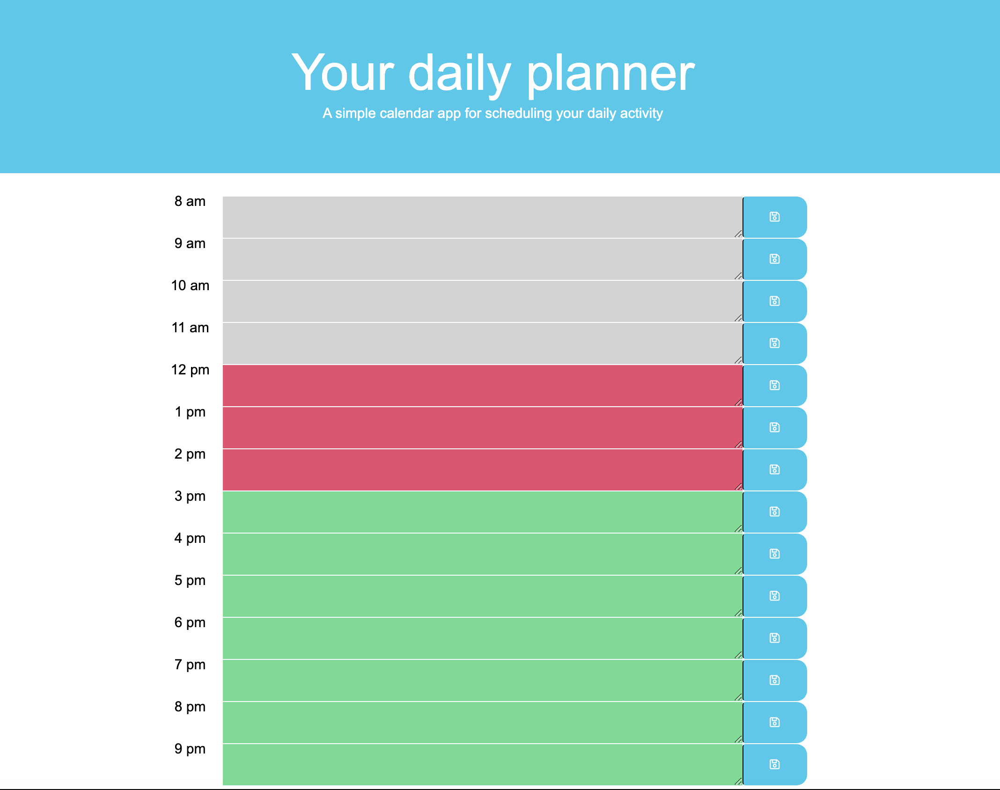

# daily-planner-homework
This app allows you to track your tasks throughout the day.

# ScreenShot

# How to use this app
1. Enter your activity that you want to complete. 
2. Save your activity by clicking the save button in the right of the block. 
3. Happy daily activity!

# Features
- Program show your daily activities in the past, present or future
- Yout activitis will be saved into local storage so that you can keep coming back to it.

# Screenshot

